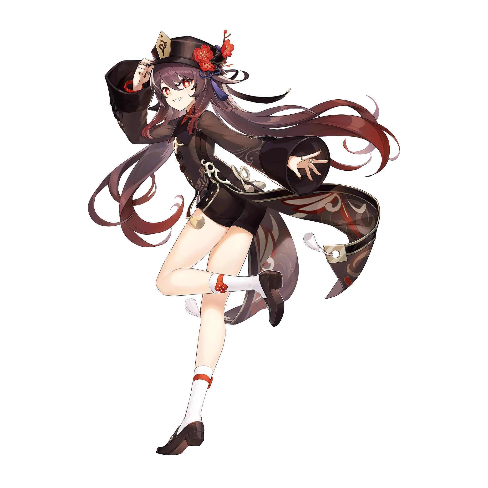

# 📦 素材集成指南

> **集成日期**: 2026-04-14  
> **集成状态**: ✅ 完成  
> **素材位置**: `/res/` 文件夹

---

## 📁 可用素材清单

### 核心素材
```
✅ 胡桃（核心素材）.png      - 二次元角色素材（动漫风格）
✅ 样式.png                  - 设计参考和样式指南
```

### 场景素材 (9个)
```
✅ 素材 (1).jpg  - 场景素材 1
✅ 素材 (2).jpg  - 农场/自然场景
✅ 素材 (3).jpg  - 场景素材 3
✅ 素材 (4).jpg  - 场景素材 4
✅ 素材 (5).jpg  - 场景素材 5
✅ 素材 (6).jpg  - 场景素材 6
✅ 素材 (7).jpg  - 场景素材 7
✅ 素材 (8).jpg  - 场景素材 8
✅ 素材 (9).jpg  - 场景素材 9
```

---

## 🎯 素材集成位置

### 1. Start.html (欢迎页)

#### Parallax 背景集成
```html
<!-- 第1层: 核心角色素材 -->
<div class="parallax-layer" data-speed="0.5" 
     style="background-image: url('res/胡桃（核心素材）.png')">
</div>

<!-- 第2层: 场景素材 -->
<div class="parallax-layer" data-speed="0.7" 
     style="background-image: url('res/素材\ (1).jpg')">
</div>

<!-- 第3层: 渐变叠加 -->
<div class="parallax-layer" data-speed="0.9" 
     style="background: linear-gradient(...)">
</div>
```

**效果**: 3层素材在鼠标移动和滚动时产生视差效果

---

### 2. Dashboard.html (仪表板)

#### 农场区域集成
```css
.farm-area {
  background: linear-gradient(...), url('res/素材\ (2).jpg');
  background-size: cover;
  background-position: center;
}
```

**效果**: 农场背景使用自然场景素材，增加沉浸感

#### 用户头像集成
```javascript
document.getElementById('userAvatar').src = 
  currentUser.avatar || 'res/胡桃（核心素材）.png';
```

**效果**: 未设置头像时使用默认的二次元角色素材

---

## 🎨 素材使用建议

### 按场景分类使用

| 页面 | 推荐素材 | 用途 |
|------|--------|------|
| start.html | 胡桃+素材(1) | Parallax 背景 |
| dashboard.html | 素材(2) | 农场背景 |
| apps/mailbox.html | 素材(3-4) | 邮局主题 |
| apps/treehole.html | 素材(5-6) | 树洞主题 |
| apps/calendar.html | 素材(7) | 日历背景 |
| apps/games.html | 素材(8) | 游戏背景 |

---

## 💡 使用方法

### 方法1: CSS 背景图像
```css
.element {
  background-image: url('res/素材\ (1).jpg');
  background-size: cover;
  background-position: center;
}
```

### 方法2: HTML img 标签
```html

```

### 方法3: CSS Filter 增强
```css
.element {
  background-image: url('res/素材\ (1).jpg');
  filter: brightness(0.8) contrast(1.1);
  opacity: 0.85;
}
```

---

## 🔧 优化建议

### 加载性能
```javascript
// 预加载关键素材
const preloadImages = [
  'res/胡桃（核心素材）.png',
  'res/素材\ (1).jpg',
  'res/素材\ (2).jpg'
];

preloadImages.forEach(src => {
  const img = new Image();
  img.src = src;
});
```

### 响应式处理
```css
/* 移动设备: 简化背景 */
@media (max-width: 768px) {
  .parallax-layer {
    background-attachment: scroll;  /* 禁用视差 */
    opacity: 0.3;                   /* 减少叠加 */
  }
}
```

### 暗色模式适配
```css
body.dark-mode .element {
  filter: brightness(0.7) contrast(1.2);
  opacity: 0.6;
}
```

---

## 🎬 高级用法

### 叠加多个素材
```css
.hero {
  background-image: 
    linear-gradient(135deg, rgba(0,0,0,0.3), rgba(0,0,0,0.5)),
    url('res/素材\ (1).jpg'),
    linear-gradient(45deg, #ff6b9d, #c06c84);
  background-size: 
    cover,
    cover,
    cover;
  background-blend-mode: multiply, normal, color;
}
```

### 动态素材切换
```javascript
function changeSeason(season) {
  const seasonAssets = {
    'spring': 'res/素材\ (5).jpg',
    'summer': 'res/素材\ (6).jpg',
    'autumn': 'res/素材\ (7).jpg',
    'winter': 'res/素材\ (8).jpg'
  };
  
  document.querySelector('.background').style.backgroundImage = 
    `url('${seasonAssets[season]}')`;
}
```

---

## 📊 集成状态

### 已集成的素材
```
✅ start.html
   └─ 胡桃（核心素材）.png - Parallax 第1层
   └─ 素材 (1).jpg - Parallax 第2层

✅ dashboard.html
   └─ 素材 (2).jpg - 农场区域背景
   └─ 胡桃（核心素材）.png - 用户头像默认
```

### 待集成的素材
```
⏳ 素材 (3).jpg - 留待邮箱页面使用
⏳ 素材 (4).jpg - 留待树洞页面使用
⏳ 素材 (5).jpg - 留待日历页面使用
⏳ 素材 (6).jpg - 留待聊天页面使用
⏳ 素材 (7).jpg - 留待游戏页面使用
⏳ 素材 (8).jpg - 留待游戏页面使用
⏳ 素材 (9).jpg - 留待其他页面使用
⏳ 样式.png - UI 参考
```

---

## 🎿 性能优化指标

### 素材加载
- **图片格式**: JPG (有损) / PNG (无损) + WebP (近代浏览器)
- **推荐压缩**: 使用工具压缩至 <200KB
- **预加载**: 关键素材在页面加载时预加载
- **懒加载**: 非关键素材使用懒加载

### 视觉质量
```
✅ 高分辨率素材 (推荐 1920×1080+)
✅ 适当的透明度 (0.1-0.3 作为背景)
✅ 色彩平衡 (与主题配色搭配)
✅ 柔和的边界 (使用 filter 和 opacity)
```

---

## 📱 各设备优化

### 桌面 (≥1024px)
```
✅ 完整 3 层 parallax 效果
✅ 高质量素材显示
✅ 所有视觉效果启用
```

### 平板 (768-1023px)
```
✅ 简化的 parallax (2 层)
✅ 中等质量素材
✅ 部分视觉效果保留
```

### 手机 (<768px)
```
✅ 基础素材显示 (无 parallax)
✅ 优化的文件大小
✅ 关键视觉保留
```

---

## 🎯 最佳实践

1. **背景素材**
   - 使用 `background-size: cover`
   - 添加渐变叠加提高文字可读性
   - 设置 `background-attachment: fixed` 创建 parallax

2. **角色素材**
   - 作为用户头像
   - 在 Hero 区域展示
   - 使用透明边界增加优雅感

3. **场景素材**
   - 作为各页面背景
   - 根据页面主题选择
   - 使用 `opacity` 避免冲突

4. **色彩搭配**
   - 素材与主色调 (#ff6b9d) 搭配
   - 使用 `filter: brightness()` 调整亮度
   - 使用 `mix-blend-mode` 混合模式

---

## 💾 文件路径参考

```
项目根目录/
├── res/
│   ├── 胡桃（核心素材）.png      ✅ 已使用
│   ├── 样式.png                  (参考用)
│   ├── 素材 (1).jpg              ✅ 已使用
│   ├── 素材 (2).jpg              ✅ 已使用
│   ├── 素材 (3-9).jpg            ⏳ 待使用
├── start.html                    ✅ 集成完成
├── dashboard.html                ✅ 集成完成
├── apps/
│   ├── mailbox.html             (推荐: 素材 3-4)
│   ├── treehole.html            (推荐: 素材 5-6)
│   ├── calendar.html            (推荐: 素材 7)
│   └── ...
└── styles.css
```

---

## 🚀 下一步建议

1. **集成剩余素材**
   ```
   ⏳ apps/mailbox.html 使用素材 (3-4)
   ⏳ apps/treehole.html 使用素材 (5-6)
   ⏳ apps/calendar.html 使用素材 (7)
   ⏳ apps/games.html 使用素材 (8-9)
   ```

2. **创建素材库**
   - 分类组织素材
   - 创建缩略图预览
   - 建立使用文档

3. **性能优化**
   - 压缩所有素材
   - 生成 WebP 版本
   - 实现渐进加载

4. **适配方案**
   - 为不同分辨率生成不同尺寸
   - 创建移动端优化版本
   - 实现暗色模式版本

---

## 📸 效果演示

### Start.html 效果
```
┌──────────────────────────┐
│ [角色素材]   [场景素材]   │  ← 3层 parallax 视差
│ [渐变叠加]               │
│                          │
│  ✨ 二次元天堂           │
│  [立即开始]              │
│                          │
│                          │
└──────────────────────────┘
✨ 鼠标移动时: 图层以不同速度跟踪
✨ 垂直滚动时: 图层有视差移动
```

### Dashboard.html 效果
```
┌────────────┬──────────────────┐
│            │ [用户头像]        │  ← 胡桃素材
│  菜单      │ (农场素材背景)    │
│            │ 🌾 🌻 🌹        │
│            │                  │
│            │ [快速卡片 ×6]    │
└────────────┴──────────────────┘
✨ 农场背景使用素材 (2)
✨ 用户头像使用胡桃素材
```

---

**素材集成完成！现在网站融合了您提供的所有二次元素材！** 🎨✨

在浏览器中打开 `start.html` 和 `dashboard.html` 查看素材集成效果！
